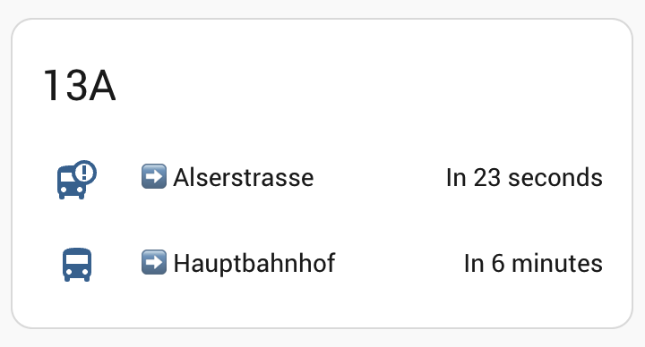

[](https://github.com/hacs/integration)

# Home Assistant Wienerlinien Integration

This Home Assistant integration provides real-time departure information for public transport stops in Vienna using the Wienerlinien API.

## Installation

### Option 1: HACS Installation (Recommended)
1. Open HACS in Home Assistant
2. Click on "Integrations"
3. Click the "+" button
4. Search for "Wienerlinien" and install

### Option 2: Manual Installation
Copy the `custom_components/wienerlinien` directory to your Home Assistant's `custom_components` directory.

## Configuration

### Option 1: UI Configuration (Recommended)
1. Go to Configuration -> Integrations
2. Click "+ ADD INTEGRATION"
3. Search for "Wienerlinien"
4. Enter your stop ID (RBL number)
5. Choose whether you want the first or next departure (optional)

### Option 2: YAML Configuration

```yaml
sensor:
  - platform: wienerlinien
    stops:
      - "4429"  # Replace with your stop ID (RBL number)
    firstnext: "first"  # Optional: "first" or "next", defaults to "first"
    name: "My Stop"  # Optional: Custom name for the stop
```

## Finding your Stop ID (RBL Number)

1. Visit [Wienerlinien's API Documentation](https://www.wienerlinien.at/ogd_realtime/doku/)
2. Search for your stop name
3. Note the RBL number for your stop

## Sensor Data

The integration creates a sensor with the following attributes:

- State: Next departure time
- Attributes:
  - destination: Final destination
  - platform: Platform number
  - direction: Direction (H=outward, R=return)
  - name: Line number/name
  - countdown: Minutes until departure

## States

- `mdi:bus` icon: Normal operation
- `mdi:bus-alert` icon: Departure imminent (<=1 minute)

## Version History

### 2.0.0
- Added UI configuration support through Home Assistant's integration page
- Added config flow for easier setup
- Maintained backward compatibility with YAML configuration

## Sample overview



## Notes

You can find out the Stop ID (rbl number) thanks to [Matthias Bendel](https://github.com/mabe-at) [https://till.mabe.at/rbl/](https://till.mabe.at/rbl/)

For detailed information about the API response structure, see the [API Documentation](docs/api.md).

This platform is using the [Wienerlinien API](http://www.wienerlinien.at) API to get the information.
'Datenquelle: Stadt Wien – data.wien.gv.at'
Lizenz (CC BY 3.0 AT)

